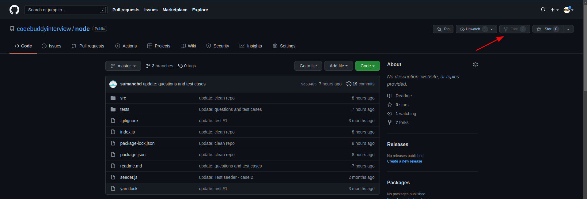

# Welcome to Round 3 of your NodeJS Interview
# 

> This round is to test your **Debugging capabilities, Code optimization skills and Code quality** in a real world application.

> This repo uses express js and mongooose to create a backend server and performs DB(MongoDB) operations.

> **_Please carefully read the instructions mentioned below._**

# Note
1. **DON'T CLONE THIS REPO and DON'T MAKE PULL REQUESTS TO THIS REPO.** FORK this repo to your own GitHub account then clone it. Fork button is the top right corner of the page. The forked URL should look something like this: https://github.com/${YOUR_GITHUB_USERNAME}/node
# 
2. **You should not use any external library for pagination.**
3. **You should not use JS for paginating the data, pagination has to be done on DB directly.**
3. Create a new `.env` file by copying the `.env.example` file. Run `cp .env.example .env`
4. Install the dependencies by running `yarn` or `npm i`.
5. Run `npm run test` or `yarn test` to run the test cases. **All test cases should pass in your final submit otherwise the task is considered as incomplete.**
6. `npm run seed` or `yarn seed` creates 100 users and 1-5 posts per user. **Use this seeder to populate the database.**
7. Work on `src/controllers/user.controller.js@getUsersWithPostCount` TODO section only.

# Task
`[GET] http://localhost:3000/users` should return all the users with their post count. This API should have server side pagination implemented.

The response from this API should be similar to the below mentioned response format.

```
{
    "data": {
        "users": [
            {
                "_id": "624bccc95debe2a2672738a0",
                "name": "Jacklyn",
                "posts": 2
            },
            {
                "_id": "624bccc95debe2a2672738a1",
                "name": "Jefferey",
                "posts": 2
            },
            {
                "_id": "624bccc95debe2a2672738a2",
                "name": "Mateo",
                "posts": 2
            },
            {
                "_id": "624bccc95debe2a2672738a3",
                "name": "Lyric",
                "posts": 2
            },
            {
                "_id": "624bccc95debe2a2672738a4",
                "name": "Shannon",
                "posts": 2
            },
            {
                "_id": "624bccc95debe2a2672738a5",
                "name": "Evelyn",
                "posts": 2
            },
            {
                "_id": "624bccc95debe2a2672738a6",
                "name": "Brad",
                "posts": 2
            },
            {
                "_id": "624bccc95debe2a2672738a7",
                "name": "Leslie",
                "posts": 2
            },
            {
                "_id": "624bccc95debe2a2672738a8",
                "name": "Laron",
                "posts": 2
            },
            {
                "_id": "624bccc95debe2a2672738a9",
                "name": "Lizeth",
                "posts": 2
            }
        ],
        "pagination": {
            "totalDocs": 100,
            "limit": 10,
            "page": 1,
            "totalPages": 10,
            "pagingCounter": 1,
            "hasPrevPage": false,
            "hasNextPage": true,
            "prevPage": null,
            "nextPage": 2
        }
    }
}
```

### Time allocated: 1hr 30min (if you need extra time please reach out to the HR who is taking your interview).
